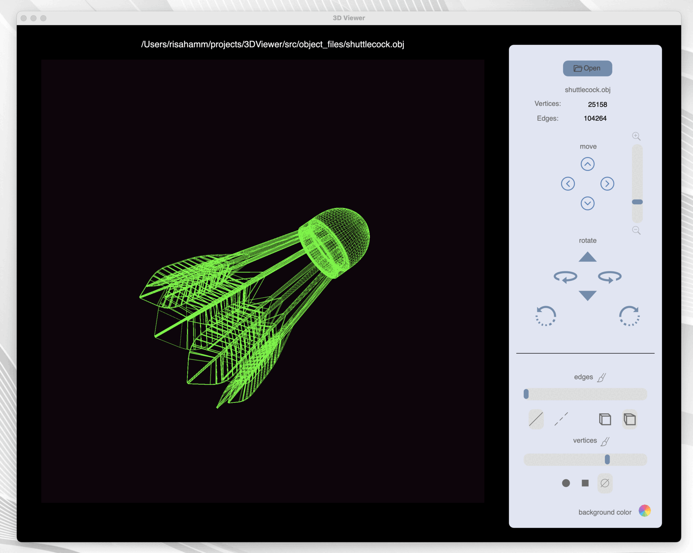

# 3DViewer

### Программа для просмотра 3D моделей.

Программа предназначена для визуализации и взаимодействия с трехмерными моделями.

  

#### Основные функции. Приложение позволяет:

- Загружать каркасную модель из файла формата .obj;
- Перемещать модель на заданное расстояние относительно осей X, Y, Z;
- Поворачивать модель на заданный угол относительно своих осей X, Y, Z;
- Масштабировать модель на заданное значение;
- Настраивать тип проекции (параллельная и перспективная);
- Настраивать тип (сплошная, пунктирная), цвет и толщину ребер, способ отображения (отсутствует, круг, квадрат), цвет и размер вершин;
- Выбирать цвет фона;
- Пользователские настройки сохраняются между перезапусками программы.

---

- Программа разработана на языке C++ стандарта C++17 с использованием компилятора gcc;
- Код программы находится в папке *src*;
- Код написан в соответствии с Google Style;
- Классы реализованы внутри пространства имен `s21`;
- Подготовлено полное покрытие unit-тестами классов для вычислений c помощью библиотеки GTest;
- Реализован графический интерфейс пользователя на базе Qt 6.7.
- Программа реализована на основе MVC-паттерна.
- Предусмотрен Makefile для сборки библиотеки с целями *all, install, uninstall, clean, check_style, dvi, dist, test, gcov_report*.
- Директория установки - `src/build`.
- Цель `dvi` обеспечивает доступ к документации, оформленной с помощью doxygen.
- Цель `dist` выполняет создание tar-файла, содержащего дистрибутивную   
  поставку программы.